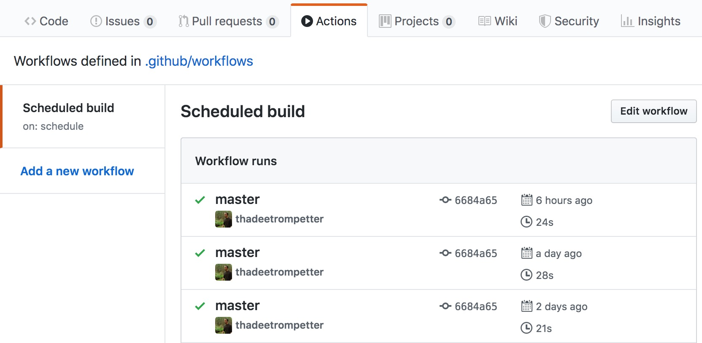
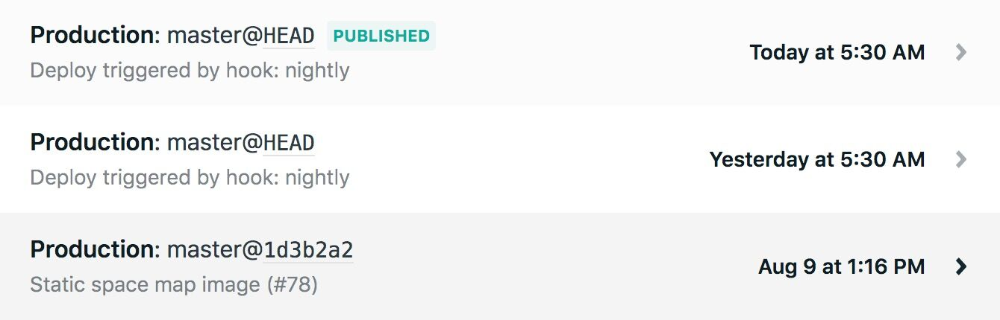

# Demo Netlify Cron Deploy Workflow

Schedule Netlify deploys by triggering a build hook from a [GitHub workflow](.github/workflows/scheduled-build.yml):

```yml
name: Scheduled build
on:
  schedule:
  - cron: '30 3 * * *'
jobs:
  build:
    runs-on: ubuntu-latest
    steps:
    - name: Trigger our build webhook on Netlify
      run: curl -s -X POST "https://api.netlify.com/build_hooks/${TOKEN}"
      env:
        TOKEN: ${{ secrets.NETLIFY_CRON_BUILD_HOOK }}
```

We can see our scheduled builds under the Actions tab of our GitHub repository and the deploy logs on Netlify:





**For more info, read our blog post [Scheduling Netlify deploys with GitHub Actions](https://www.voorhoede.nl/en/blog/scheduling-netlify-deploys-with-github-actions/).**